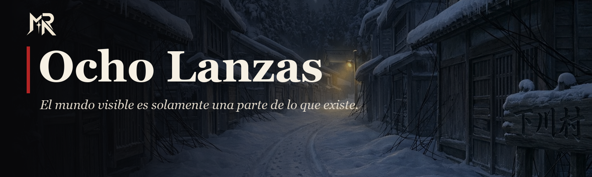
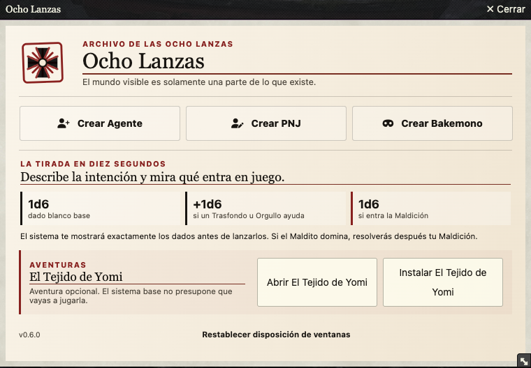
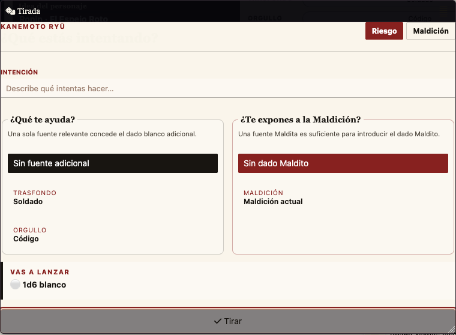
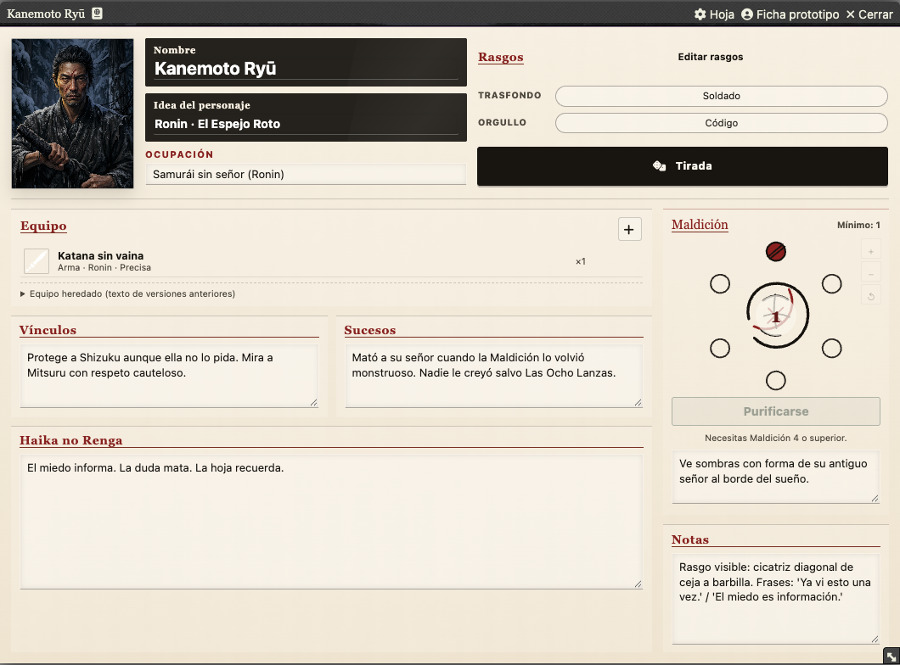

<p align="center">
  
</p>

# Ocho Lanzas para Foundry VTT

<p align="center">
  <a href="https://github.com/ManuRomera/ocho-lanzas/releases/latest"></a>
  <a href="https://foundryvtt.com"></a>
  <a href="https://github.com/ManuRomera/ocho-lanzas/releases"></a>
  
</p>

Sistema **no oficial** para jugar *Ocho Lanzas* en Foundry VTT. El objetivo de esta implementación es que Foundry desaparezca lo máximo posible durante la partida: fichas legibles, información bajo demanda y automatización solo donde reduce trabajo real.

> Menos software visible, más Ocho Lanzas.

## Así se ve

<p align="center">
  
  
</p>
<p align="center">
  
</p>

## Compatibilidad

La versión 0.6.0 mantiene **un único paquete** para Foundry VTT **13 y 14**. Las diferencias de API se encapsulan en `scripts/compat/foundry-compat.mjs`; no existen builds separados por versión.

> Importante: migrar un world desde Foundry 13 a Foundry 14 debe hacerse siguiendo el procedimiento y copia de seguridad normal de Foundry. La compatibilidad del sistema no convierte una migración de world de Foundry en reversible.

## Qué incluye

- Ficha de Agente horizontal, centrada en la Maldición y pensada para verse casi completa alrededor de 1060×780.
- Fichas diferenciadas para PNJ y Bakemono.
- Trasfondos, Orgullos y Onmyōji compactos durante el juego y editables cuando hace falta.
- Tirada de Riesgo con resumen previo exacto de dados.
- Tirada de Maldición y Purificación integradas en chat.
- Items reales de Foundry para equipo, armas, rituales y estados.
- Información contextual con **hover**, clic izquierdo en chips y **botón derecho** persistente.
- Memoria por usuario de posición y tamaño de las ventanas propias.
- Integración opcional de Dice So Nice para el dado Maldito.
- Creación de macros estables al arrastrar Actores o Items a la hotbar.
- Aventura integrada **El Tejido de Yomi**, desacoplada de los flujos normales del sistema.

## Dirección visual 0.6

La interfaz 0.6 utiliza una única arquitectura CSS modular. Se retiraron las capas históricas 0.2/0.3/0.5 que competían entre sí. La identidad se basa en **papel marfil, tinta, rojo hanko oscuro, oro apagado y marcas rituales originales**, con la Maldición como elemento gráfico de firma.

Los nuevos recursos originales de interfaz están documentados en [docs/VISUAL.md](docs/VISUAL.md).

## Instalación

Usa el manifest de la última release:

`https://github.com/ManuRomera/ocho-lanzas/releases/latest/download/system.json`

No se recomienda instalar directamente desde `main`.

## Uso básico

Al abrir por primera vez la versión 0.6 aparece la bienvenida de Ocho Lanzas. Desde ella puedes crear un Agente, PNJ o Bakemono y, si diriges la partida, preparar El Tejido de Yomi.

En la ficha del Agente:

- clic izquierdo ejecuta la acción principal;
- dejar el cursor sobre un rasgo u objeto muestra información breve;
- botón derecho fija esa información para poder leerla;
- doble clic sobre un Item abre su ficha;
- el GM dispone de las correcciones administrativas de Maldición;
- el jugador conserva Purificación cuando las reglas lo permiten.

## El Tejido de Yomi

El contenido de la aventura sigue distribuido con el sistema en esta versión, pero ya no gobierna la interfaz general. Tiene su acceso principal desde la bienvenida; la interfaz normal del sistema no se convierte en un panel de Yomi. La instalación es idempotente mediante identificadores estables (`tejidoSlug`) y el sistema migra las rutas antiguas de assets al árbol canónico `assets/`.

La arquitectura queda preparada para extraer la aventura a un módulo independiente sin que el motor base dependa de ella.

## API pública para macros

Las macros deben usar la API pública del sistema en lugar de copiar lógica interna:

```js
await game.ochoLanzas.roll();
await game.ochoLanzas.rollCurse();
await game.ochoLanzas.openDocument("Actor.xxxxx");
game.ochoLanzas.openWelcome();
game.ochoLanzas.openTejidoDeYomi();
```

Se puede pasar un Actor, su id o UUID a `roll` y `rollCurse`. Sin argumento se intenta usar el token controlado o el personaje asignado al usuario.

## Desarrollo y validación

`node tools/validate-release.mjs`

El workflow de GitHub Actions valida las rutas, manifiesto, plantillas y recursos de texto antes de crear una release versionada.

## Créditos y estado

Implementación y mantenimiento del sistema Foundry: **Manu Romera**.

Este repositorio es un proyecto **no oficial**. Consulta [DERECHOS.md](DERECHOS.md) para la separación entre código del proyecto y materiales de terceros.

---

<p align="center">
  <a href="https://github.com/ManuRomera">
    <picture>
      <source media="(prefers-color-scheme: dark)" srcset="https://raw.githubusercontent.com/ManuRomera/ManuRomera/main/brand/MR_09_Monograma_Marfil_Transparente.png">
      
    </picture>
  </a><br>
  <sub>Hecho por <a href="https://github.com/ManuRomera"><b>Manu Romera</b></a> · Digital RPG Design</sub>
</p>
